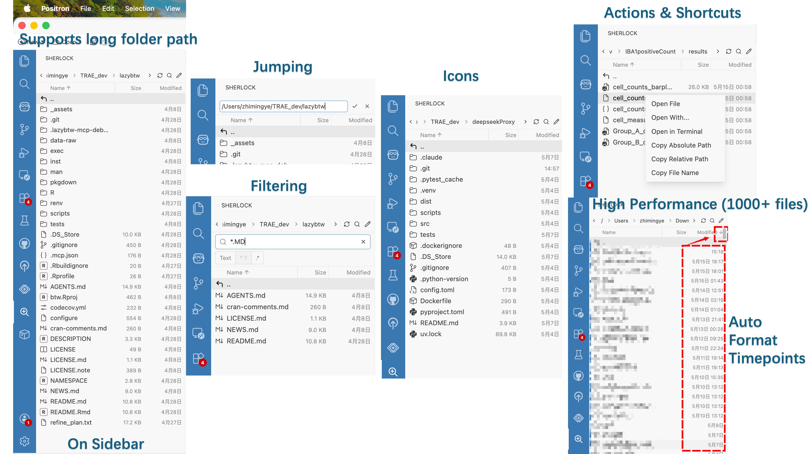

# Sherlock

Browse your filesystem like a detective. A VS Code sidebar extension that shows one
directory at a time with fast filtering and full keyboard control. Works anywhere —
local disk, SSH remote, container — not limited to the workspace.



Inspired by [wch/file-navigator](https://github.com/wch/file-navigator), with the goal of
bringing an RStudio-style file browsing experience into VS Code. Most of the code in this
project was generated by Codex and DeepSeek V4 Pro.

## Features

- **Flat directory view** — one folder per screen, files sorted by name/size/date
- **Path bar** — click any segment to jump, double-click to type a path directly
- **Instant filter** — text search, wildcards (`*` `?`), or full regex
- **Keyboard driven** — arrows to move, Enter to open, Backspace to go up
- **Auto-refresh** — picks up file changes automatically
- **Right-click actions** — copy path, open with…, terminal in folder
- **Virtual scrolling** — handles huge directories without lag
- **Symlink badges** — visual indicator for symbolic links

## Quick start

```
npm install
npm run build
```

Press F5 in VS Code to launch.

## Packaging as .vsix

Build the extension and bundle it into a `.vsix` file for distribution or side-loading.

### 1. Install the packaging tool

```
npm install -g @vscode/vsce
```

`@vscode/vsce` (VS Code Extension Manager) is the official CLI for packaging and publishing
VS Code extensions.

### 2. Build the extension

```
npm run build
```

This runs esbuild to produce the bundled `dist/extension.js` (Node, CJS) and
`dist/client/main.js` (browser, ESM) plus `dist/client/main.css` (Tailwind).

### 3. Package into .vsix

```
vsce package
```

This creates `sherlock-0.1.0.vsix` in the project root. The command respects
`.vscodeignore` so source files, configs, and dev artifacts are excluded
from the package.

To skip npm dependency checks (useful when `node_modules` is already installed):

```
vsce package --no-dependencies
```

### 4. Install in VS Code

**Method A — Command palette**

1. Open VS Code
2. `Cmd+Shift+P` → **Extensions: Install from VSIX…**
3. Select `sherlock-0.1.0.vsix`
4. Reload when prompted

**Method B — CLI**

```
code --install-extension sherlock-0.1.0.vsix
```

**Method C — Drag and drop**

Drag the `.vsix` file onto the Extensions panel in VS Code.

The Sherlock icon will appear in the activity bar. Click it to open the browser.

### 5. Verify

Check the Extensions panel (`Cmd+Shift+X`) — Sherlock should be listed under installed
extensions. Click the magnifying glass icon in the activity bar to open the directory browser.

## License

MIT
